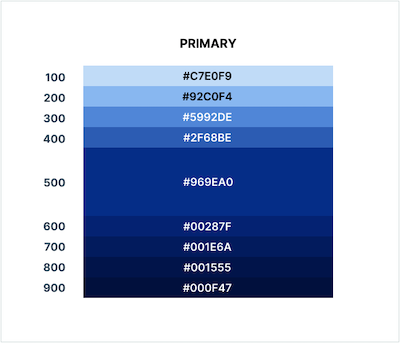
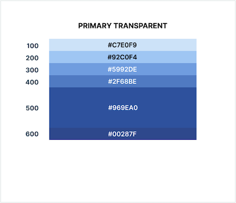
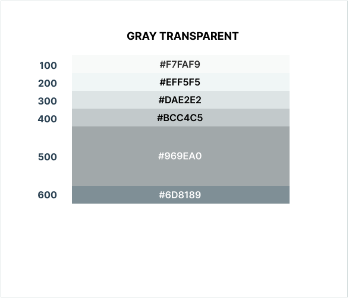

# Color Use Introduction

Lorem ipsum dolor sit amet, consetetur sadipscing elitr, sed diam nonumy eirmod tempor invidunt ut labore et dolore magna aliquyam erat, sed diam voluptua. At vero eos et accusam et justo duo dolores et ea rebum.

<DarkWrapper>

## Colors for Web & Digital

### Branding Palette Tints & Shades 

Primary Regular             |  Primary Transparent
:-------------------------:|:-------------------------:
  |  

</DarkWrapper>

## Grayscale Palette Solids, Tints & Shades

Colors Gray Normal            |  Colors Gray Light
:-------------------------:|:-------------------------:
  |  

